# Gallery

Publication-style SVG from xpict (same paint as the library APIs).

Label scripts: [Label markup](label-markup.md).

## Structures

<figure markdown="span">
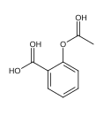
<figcaption>Aspirin</figcaption>
</figure>

<figure markdown="span">
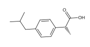
<figcaption>Ibuprofen</figcaption>
</figure>

<figure markdown="span">
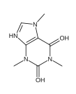
<figcaption>Caffeine</figcaption>
</figure>

<figure markdown="span">
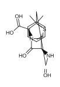
<figcaption>Penicillin G</figcaption>
</figure>

<figure markdown="span">
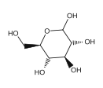
<figcaption>Glucose (stereo SMILES)</figcaption>
</figure>

<figure markdown="span">
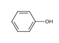
<figcaption>Phenol</figcaption>
</figure>

<figure markdown="span">

<figcaption>Benzene</figcaption>
</figure>

<figure markdown="span">
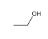
<figcaption>Ethanol</figcaption>
</figure>

## Markush labels

CX braced markup (`R_{1}` inside the trailer):

<figure markdown="span">
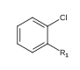
<figcaption>CX — <code>|$R_{1};;;;;$|</code> → R₁</figcaption>
</figure>

<figure markdown="span">
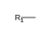
<figcaption><code>star_labels: ["$R_1$"]</code> → R₁</figcaption>
</figure>

## Shading atoms and bonds

Atom (and bond) scores drive plot-dot shading — most sites quiet, a few hot:

<figure markdown="span">
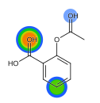
<figcaption>Aspirin</figcaption>
</figure>

<figure markdown="span">
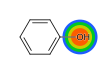
<figcaption>Phenol</figcaption>
</figure>

<figure markdown="span">
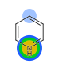
<figcaption>Pyridine</figcaption>
</figure>

