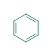
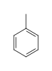
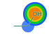

# xpict

**Molecule depiction** for publication-quality SVG — one Rust paint core, with
RDKit layout at each language edge (Python, JavaScript/WASM, native Rust).

[Gallery](gallery.md) · [Install](install.md) · [API](api/overview.md)

Two first-class APIs share the same paint:

| API | Shape | Good for |
| --- | --- | --- |
| **Single molecule** | `mol` → `render` → `toSvg` | One structure, options, `align_to` |
| **Declarative document** | nested JSON (`type: "mol"` / `group`) | Batches and a document model that is still expanding |

## Single molecule

Build a mol, render with options, turn the scene into SVG.

=== "JavaScript"

    ```js
    import { xpict } from "@xenosite/xpict";

    const benzene = xpict.mol("c1ccccc1");
    const rendered = await xpict.render(benzene, {
      color: "#0b6e4f",
      atom_shade: [0, 0, 0.2, 0, 0, 0.9],
    });
    const svg = xpict.toSvg(rendered.scene);

    // Align a second mol onto the first pose
    const aligned = await xpict.render(xpict.mol("Cc1ccccc1"), {
      align_to: benzene, // or align_to: rendered
    });
    ```

=== "Rust"

    ```rust
    use xpict::{mol, MolRenderOptions};

    let mut benzene = mol("c1ccccc1")?;
    let rendered = benzene.render(MolRenderOptions {
        color: Some("#0b6e4f".into()),
        atom_shade: Some(vec![0.0, 0.0, 0.2, 0.0, 0.0, 0.9]),
        ..Default::default()
    })?;
    let svg = rendered.to_svg();
    ```

=== "Python"

    Python’s shipped surface is the **document** API below (`render({…})`).
    A Mol-object client matching JS/Rust is not on PyPI yet.

<div class="example-out" markdown>

<figure markdown="span">

<figcaption>`color: "#0b6e4f"`</figcaption>
</figure>

<figure markdown="span">

<figcaption>Atom shading</figcaption>
</figure>

<figure markdown="span">

<figcaption>Query mol for `align_to`</figcaption>
</figure>

</div>

Star / Markush labels on this path use `star_labels` (chem markup OK) or a
CXSMILES trailer when `star_labels` is omitted:

=== "JavaScript"

    ```js
    // Chem markup on star_labels (subscript R₁)
    const starred = await xpict.render(xpict.mol("*C"), {
      star_labels: ["$R_1$"], // or "R_{1}"
    });
    // Real CXSMILES alias (literal R1 — no subscript)
    const fromCx = await xpict.render(xpict.mol("*C |$R1;$|"));
    ```

<div class="example-out" markdown>

<figure markdown="span">

<figcaption>`star_labels: ["$R_1$"]` → R₁</figcaption>
</figure>

</div>

[Label markup](label-markup.md) · full option table in [API overview](api/overview.md).

## Declarative document

Nested JSON — a **strict subset** of future `PictSpec`. Fields today are
structure, `id`, `color`, and `shade`. Richer diagram nodes stay under
`xpict.future` until they graduate; every document must still validate as
future `PictSpec`.

=== "JavaScript"

    ```js
    const [r] = await xpict.depict({
      type: "mol",
      smiles: "CCO",
      color: "#0b6e4f",
      shade: { atoms: [0.0, 0.2, 0.9], vmin: 0, vmax: 1 },
    });
    const svg = xpict.toSvg(r.scene);

    const batch = await xpict.depict({
      type: "group",
      children: [
        { type: "mol", cxsmiles: "*c1ccccc1Cl |$R1;;;;;$|" },
        { type: "mol", smiles: "c1ccccc1O" },
      ],
    });
    ```

=== "Python"

    ```python
    from xpict import render

    svg = render({
        "type": "mol",
        "smiles": "CCO",
        "color": "#0b6e4f",
        "shade": {"atoms": [0.0, 0.2, 0.9], "vmin": 0.0, "vmax": 1.0},
    })
    ```

=== "Rust"

    ```rust
    use xpict::{depict, DepictSpec, MolNode};

    let out = depict(&DepictSpec::Mol {
        smiles: Some("CCO".into()),
        color: Some("#0b6e4f".into()),
        ..Default::default()
    })?;
    let svg = out[0].to_svg();
    ```

<div class="example-out" markdown>

<figure markdown="span">

<figcaption>Ethanol with shading</figcaption>
</figure>

<figure markdown="span">

<figcaption>`*c1ccccc1Cl |$R1;;;;;$|`</figcaption>
</figure>

</div>

## More depictions

<div class="gallery-grid" markdown>

<figure markdown="span">

<figcaption>Aspirin</figcaption>
</figure>

<figure markdown="span">

<figcaption>Caffeine</figcaption>
</figure>

<figure markdown="span">

<figcaption>Markush</figcaption>
</figure>

</div>

<a class="md-button md-button--primary" href="gallery.md">Full gallery</a>
<a class="md-button" href="js/demo/">JS align demo</a>

## Packages

| Language | Package | Docs |
| --- | --- | --- |
| Python | [`xpict`](https://pypi.org/project/xpict/) | [API](api/python.md) |
| JavaScript | [`@xenosite/xpict`](https://www.npmjs.com/package/@xenosite/xpict) | [API](api/javascript.md) |
| Rust | [`xpict`](https://crates.io/crates/xpict) / [`xpict-core`](https://crates.io/crates/xpict-core) | [API](api/rust.md) |
