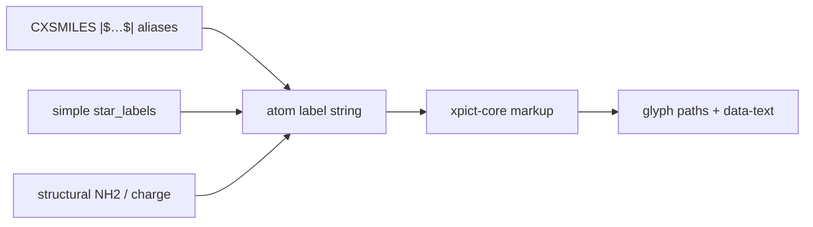

# Chem label markup

xpict uses a **small internal dialect** for atom / star labels — not KaTeX,
MathJax, or a Markdown engine. It lives in Rust (`xpict-core::markup`) so
JavaScript, Python, and native Rust share one path into Liberation Sans glyph
outlines.

Structural labels (`NH2`, charges) emit the same markup (`H_{2}`, `^{+}`) and
go through the same parser. There is no second script pathway.

## Dialect

| Input | Result | Notes |
| --- | --- | --- |
| `my_name` | `my_name` | Bare `_` is literal outside `$…$` |
| `R_1` | `R_1` | Same — not a subscript |
| `$R_1$` | R₁ | Bare `_` scripts **only** inside `$…$` |
| `H_{2}` / `$R_{10}$` | H₂ / R₁₀ | Braced `_{…}` always subscripts |
| `R^2` / `R^{2+}` | R² / R²⁺ | `^` always superscripts |
| `\alpha` `\beta` `\Delta` … | α β Δ | Same names as Python `richtext` |
| `**bold**` / `*italic*` | face flags | Markdown emphasis |
| `\textbf{…}` `\textit{…}` | face flags | LaTeX-ish style cmds |
| `\_` `\*` `\^` `\$` `\\` | literals | Escapes |

Examples:

```text
$R_1$
R^2
$\alpha$-D-Glc
**R**^2
$\beta_{D}$
```

Molecule-level `bold_labels` (simple API) sets the base face; markup
bold/italic OR on top (so `*cis*` with bold labels → BoldItalic).

## How labels get into paint

Three common inputs converge on the same markup parser:



Bare `R1` (no markup) stays the literal characters **R1**. For subscripts,
pass chem markup (`R_{1}`, `$R_1$`) via `star_labels` — not as ChemAxon CX
syntax.

## CXSMILES aliases

ChemAxon atom labels sit in a trailer whose **delimiters are `$`**:

```text
*c1ccccc1Cl |$R1;;;;;$|
```

That is ordinary CXSMILES. The alias string is painted as given, so `R1`
renders as **R1** (no subscript). Unicode in the alias (`R₁`) also works when
your source encoding keeps it.

Do **not** treat xpict chem markup (`$R_1$`, `R_{1}`) as CXSMILES. Inner `$`
fights the CX `$…$` delimiters; braced forms are an xpict dialect, not
ChemAxon.

| Want | Prefer |
| --- | --- |
| Round-trip CX from another tool | CX trailer with plain aliases (`R1`, `Cl`, …) |
| Publication Markush with R₁ / Greek / bold | simple `star_labels` + chem markup |
| Both CX topology and rich labels | CX for structure; override labels via `star_labels` |

## JSON opts and the document schema

### Simple API (single mol)

```ts
// star_labels: encounter order of * atoms
await xpict.render(xpict.mol("*c1ccccc1Cl"), {
  star_labels: ["$R_1$"], // or "R_{1}"
  bold_labels: true,
});
```

```rust
mol.render(MolRenderOptions {
    star_labels: Some(vec![Some("$R_1$".into())]),
    ..Default::default()
})?;
```

`star_labels` **wins over** CX aliases when both are present.

### Declarative document

`star_labels` on mol nodes (same encounter-order semantics as the simple API),
or CX aliases on `cxsmiles` when `star_labels` is omitted:

```json
{
  "type": "group",
  "children": [
    {
      "type": "mol",
      "smiles": "*c1ccccc1Cl",
      "star_labels": ["$R_1$"]
    },
    {
      "type": "mol",
      "cxsmiles": "*c1ccccc1Cl |$R1;;;;;$|"
    }
  ]
}
```

A document-level `rgroups` field is **not** public yet (it remains on future
`PictSpec` / `MoleculeSpec`). Use CX or `star_labels` until it graduates.
