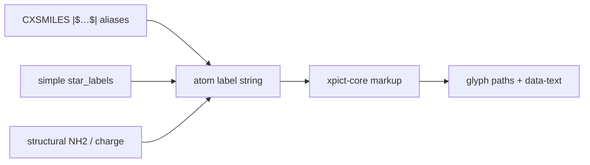

# Chem label markup

xpict uses a **small internal dialect** for atom / star labels — not KaTeX,
MathJax, or a Markdown engine. It lives in Rust (`xpict-core::markup`) so
JavaScript, Python, and native Rust share one path into Liberation Sans glyph
outlines.

Structural labels (`NH2`, charges) emit the same markup (`H_{2}`, `^{+}`) and
go through the same parser. There is no second script pathway.

## Dialect

| Input | Result | Notes |
| --- | --- | --- |
| `my_name` | `my_name` | Bare `_` is literal outside `$…$` |
| `R_1` | `R_1` | Same — not a subscript |
| `$R_1$` | R₁ | Bare `_` scripts **only** inside `$…$` |
| `H_{2}` / `$R_{10}$` | H₂ / R₁₀ | Braced `_{…}` always subscripts |
| `R^2` / `R^{2+}` | R² / R²⁺ | `^` always superscripts |
| `\alpha` `\beta` `\Delta` … | α β Δ | Same names as Python `richtext` |
| `**bold**` / `*italic*` | face flags | Markdown emphasis |
| `\textbf{…}` `\textit{…}` | face flags | LaTeX-ish style cmds |
| `\_` `\*` `\^` `\$` `\\` | literals | Escapes |

Examples:

```text
$R_1$
R^2
$\alpha$-D-Glc
**R**^2
$\beta_{D}$
```

Molecule-level `bold_labels` (simple API) sets the base face; markup
bold/italic OR on top (so `*cis*` with bold labels → BoldItalic).

## How labels get into paint

Three common inputs converge on the same markup parser:



Bare `R1` (no markup) stays the literal characters **R1**. For subscripts,
pass chem markup (`R_{1}`, `$R_1$`) on the label string.

## CXSMILES: what works, what does not

ChemAxon atom labels live inside a trailer whose **delimiters are `$`**:

```text
*c1ccccc1Cl |$R1;;;;;$|
```

That outer `|$ … $|` is CX syntax, not xpict math mode. Consequences:

| Want | In CX trailer? | Notes |
| --- | --- | --- |
| Literal `R1` | Yes | Painted as R1 (no subscript) |
| Subscript R₁ via `R_{1}` | Yes | Braced `_{…}` needs no `$…$` zone |
| Unicode `R₁` | Yes | Works if your source encoding keeps it |
| `$R_1$` math zone | **No (practical)** | Inner `$` fights the CX `$…$` delimiters |
| `\alpha`, `\beta`, … | Fragile / avoid | Backslashes and CX tooling vary |
| `**bold**` / `*italic*` | Fragile / avoid | `*` collides with star atoms and CX |
| Multi-char markup with `;` | **No** | `;` separates CX alias slots |

**Rule of thumb:** use CX for plain aliases or braced scripts (`R_{1}`,
`R_{12}`). For richer markup (`$R_1$`, Greek, bold), use the simple client's
`star_labels` (not a document `rgroups` key — that stays in `xpict.future`
until it graduates).

## JSON opts and the document schema

Full dialect is available wherever the label is a normal JSON string (no CX
`$` wrapper):

### Simple API (single mol)

```ts
// star_labels: encounter order of * atoms
await xpict.render(xpict.mol("*c1ccccc1Cl"), {
  star_labels: ["$R_1$"], // or "R_{1}"
  bold_labels: true,
});
```

```rust
mol.render(MolRenderOptions {
    star_labels: Some(vec![Some("$R_1$".into())]),
    ..Default::default()
})?;
```

`star_labels` **wins over** CX aliases when both are present.

### Preferred document (nested subset of PictSpec)

Live docs carry structure + shade + color. Markush text on the document path
is CX braced aliases today:

```json
{
  "type": "group",
  "children": [
    {
      "type": "mol",
      "cxsmiles": "*c1ccccc1Cl |$R_{1};;;;;$|"
    }
  ]
}
```

A document-level `rgroups` field is **not** on the live public surface yet
(it remains on future `PictSpec` / `MoleculeSpec`). Use CX or simple
`star_labels` until it graduates.

## Picking a path

| Goal | Prefer |
| --- | --- |
| Round-trip a CXSMILES from another tool | CX trailer; braced `R_{1}` if you need scripts |
| Publication Markush with `$R_1$`, Greek, bold | simple `star_labels` |
| Both CX topology and rich labels | CX for structure; override via `star_labels` |

## Not supported (on purpose)

Fractions, matrices, real TeX layout, Markdown `_emphasis_` (would break
`my_name`). Put chemistry scripts in `$…$` or use `_{…}` / `^{…}`.

## Why not an existing crate?

Math crates (`pulldown-latex`, `tex2math`, …) emit **MathML**. xpict paints
**glyph paths** with fake sub/superscripts so labels match bond ink. Pulling a
full math engine would add weight and a second sink without removing our
outline step.
